# BPMN 工作流执行流程图

## 系统整体执行流程

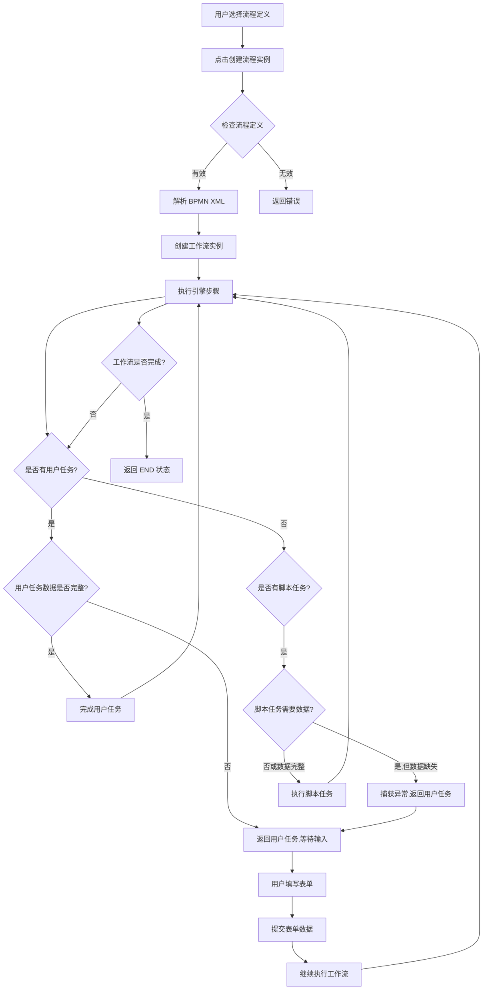

## 创建流程实例详细流程

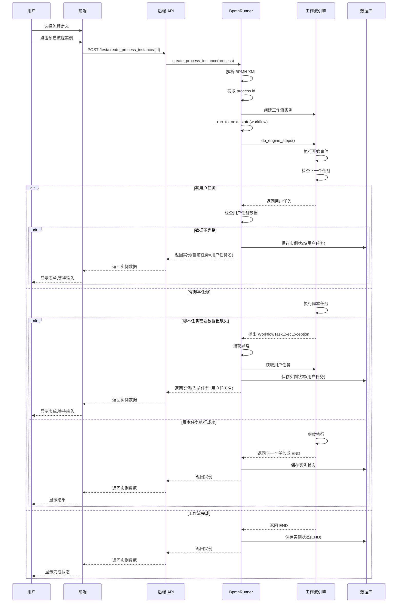

## 执行工作流步骤详细流程

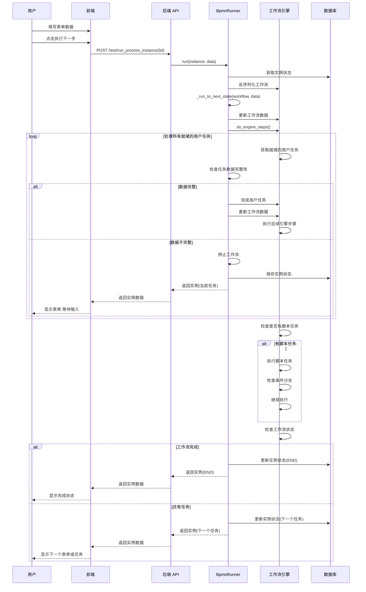

## 工作流状态转换图

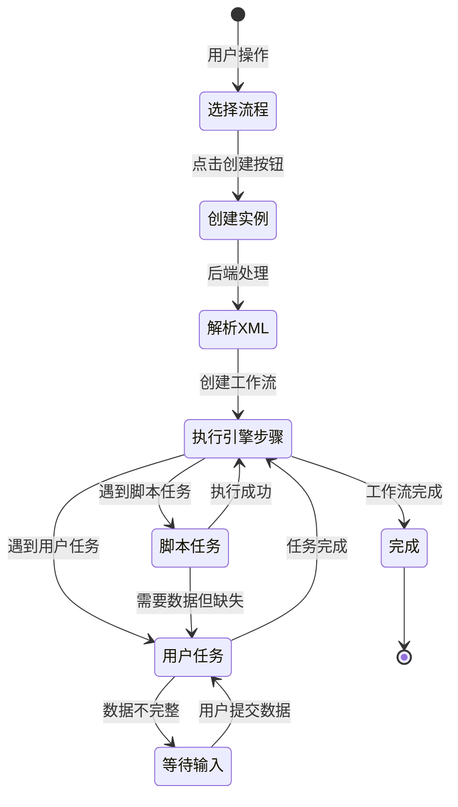

## 错误处理流程

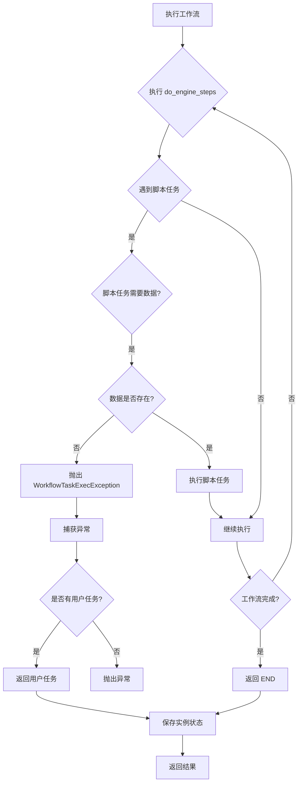

## 典型流程示例

### 1. 简单流程（无用户任务）
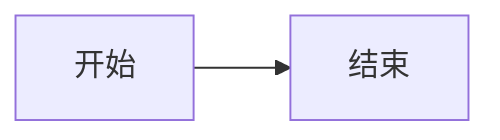

### 2. 用户任务流程
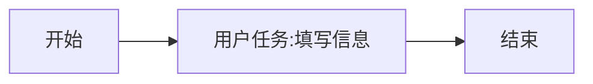

### 3. 条件分支流程
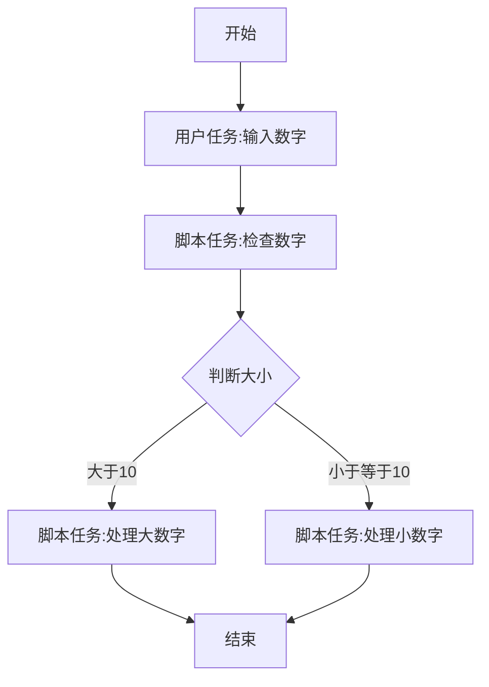

### 4. 审批流程
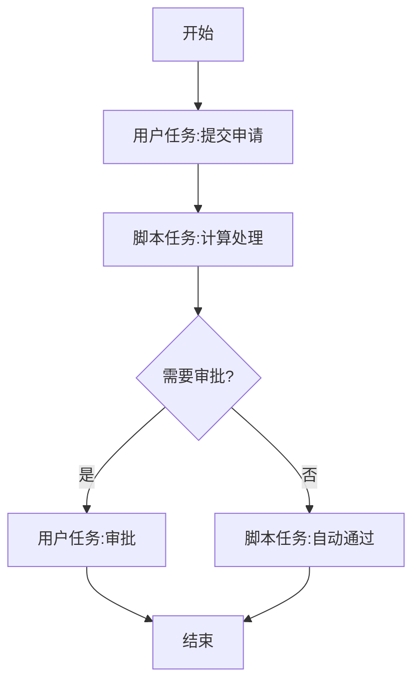

### 5. 订单处理流程
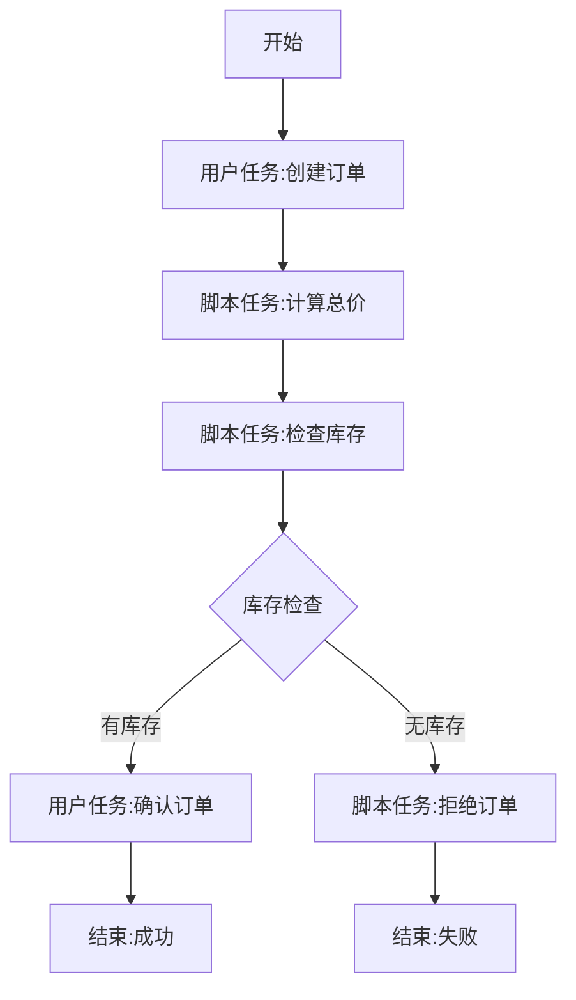

## 数据流转图

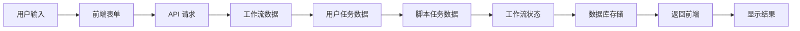

## 关键决策点

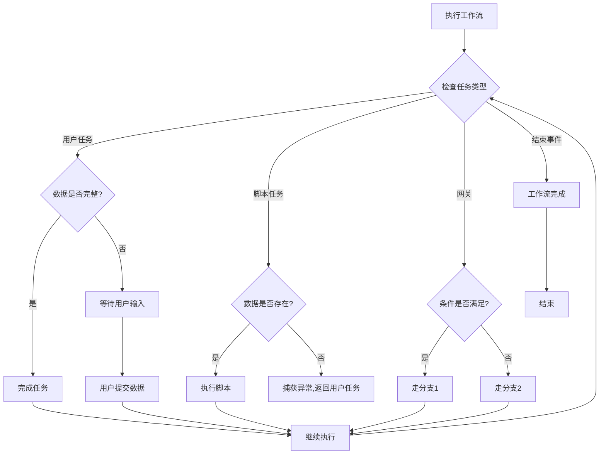

